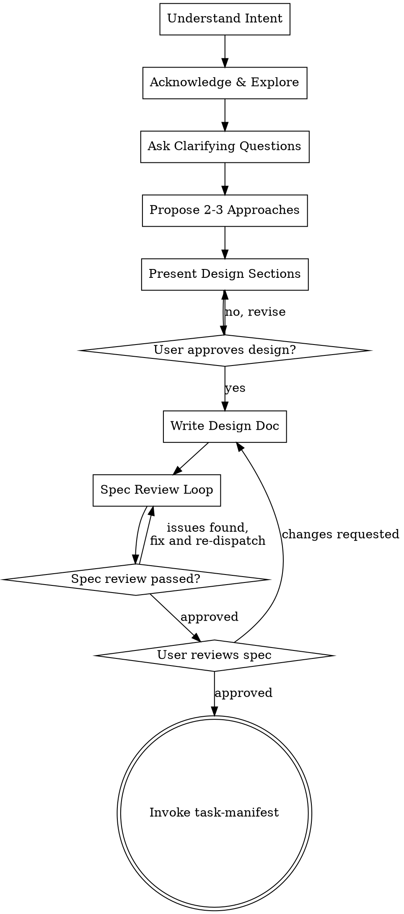

<!-- Adapted from Obra:Superpowers brainstorming skill (MIT License) -->
<!-- https://github.com/obra/superpowers -->

# Autoboard Brainstorm

You are starting a new autoboard project. Your goal is to collaboratively design a solution with the user, producing a `design.md` document.

## HARD GATE

**Do NOT implement anything.** This skill produces a design document only. Implementation happens later via `/autoboard:run`.

## Anti-Pattern: "This Is Too Simple To Need A Design"

Every project benefits from a design phase. Even "simple" features have edge cases, integration points, and decisions that benefit from explicit exploration. If you're tempted to skip design, that's a signal you haven't thought deeply enough about the problem.

## Process Flow



## Workflow

### 1. Understand Intent
- First, verify the working directory is a git repo with at least one commit:
  - Run `git rev-parse --git-dir` — if it fails, run `git init && git commit --allow-empty -m 'Initial commit'` to initialize it automatically.
  - Run `git log -1` — if it fails (no commits), run `git commit --allow-empty -m 'Initial commit'` automatically.
  - Continue — no need to ask the user.
- If the user provided a description with the command, move to step 2
- If no description was provided, ask: "What would you like to build?"
- Wait for the user's response before proceeding

### 2. Acknowledge & Explore
- Acknowledge the user's idea with brief collaborative feedback — make them feel heard before diving into process
- Then explore the **relevant** parts of the codebase using the Agent tool with `subagent_type="Explore"`
- Check files, docs, and recent commits related to the described feature
- If this is a greenfield project with no existing code to integrate with, skip the exploration

### 3. Clarifying Questions
- Ask questions **one at a time**, informed by what you found in the codebase
- Prefer **multiple choice** format when possible (A/B/C with trade-offs)
- Cover: scope, constraints, user experience, edge cases, security
- Don't ask questions you can answer from the codebase — you've already explored it

### 4. Propose Approaches
- Present **2-3 approaches** with explicit trade-offs
- Include: complexity, maintenance burden, performance, security implications
- Lead with your recommended approach and explain why
- Wait for user approval before proceeding

### 5. Write Design Doc
- Present design in sections with **approval checkpoints**
- Don't dump the entire design at once — get incremental buy-in
- Include a **Quality & Testing Strategy** section covering:
  - Which modules contain testable logic (TDD candidates)
  - **Key test scenarios per module** — not just "Module X is testable" but "Module X — key scenarios: success, invalid input, auth failure, empty state, concurrent access". Include error paths and boundary conditions, not just happy paths.
  - Performance considerations and algorithmic complexity
  - Security and trust boundaries
  - Shared abstractions that prevent duplication
- Include a **Critical User Flows** section (top-level heading `## Critical User Flows`) identifying end-to-end flows that warrant browser testing. For each flow, specify the happy path AND at least one error/edge case. Example:
  - "Login flow: valid credentials → dashboard redirect; wrong password → error message; locked account → lockout message"
  - "Form submission: valid data → success confirmation; empty required fields → validation errors; network error → retry prompt"
  - This section must be its own heading (not buried in prose) so downstream consumers (task-manifest, QA gate) can extract it.
- Auto-generate a slug from the topic (kebab-case, max 30 chars)

### 6. Create Project Structure

Before writing any files, create and switch to the feature branch:
```bash
git checkout -b autoboard/<slug>
```
If the branch already exists (re-running brainstorm for an existing project), just check it out:
```bash
git checkout autoboard/<slug>
```

On first write, create:
```
docs/autoboard/<slug>/
├── design.md
├── decisions.md         (architectural decisions register, append-only)
└── standards.md         (quality standards for session agents)
```

**Generating standards.md:** Compile a single quality standards document that will be injected verbatim into session agent prompts.

1. **Detect project structure** — infer which dimensions are relevant:
   - No frontend/UI → skip `frontend-quality`
   - No database/persistence → skip `data-modeling`
   - No API layer → skip `api-design`
   - All other dimensions included by default

2. **For each relevant dimension**, read the corresponding template file from `standards/dimensions/` in the autoboard plugin directory. Extract:
   - The **Principle** (one-liner)
   - The **Criteria** checklist
   - The **Common Violations** list
   - The **Language-Specific Guidance** section matching the project's languages/frameworks

3. **Write `standards.md`** using this format:
```markdown
# Quality Standards

Languages: {languages from design discussion}
Frameworks: {frameworks from design discussion}

## {Dimension Name}

**Principle:** {from dimension template}

**Criteria:**
{criteria checklist from dimension template}

**Common Violations:**
{common violations from dimension template}

**Language-Specific Guidance:**
{guidance for this project's languages only}

---

{Repeat for each relevant dimension}
```

4. **Present to user** — show which dimensions were included/excluded and ask if they want to adjust before proceeding

### 7. Spec Review Loop
After writing the design doc:
1. Dispatch a spec-document-reviewer subagent via the Agent tool
2. The reviewer evaluates: completeness, feasibility, security, edge cases, clarity
3. Process feedback critically (don't blindly agree)
4. Update the design doc with accepted changes
5. Repeat up to 5 iterations or until the reviewer approves

**Spec reviewer prompt template:**
> You are reviewing a design document for a software project. Evaluate it against these criteria:
> 1. **Completeness**: Are all features specified? Any gaps?
> 2. **Feasibility**: Can this be built as described? Any impossible requirements?
> 3. **Security**: Any OWASP top-10 risks? Data handling concerns?
> 4. **Edge cases**: What happens when things fail? Concurrency issues?
> 5. **Clarity**: Could an engineer implement this without asking questions?
> 6. **DRY-readiness**: Does the design avoid specifying logic in multiple places? Will implementation naturally avoid duplication?
> 7. **Performance**: Potential O(n²) patterns, N+1 issues, unnecessary I/O?
> 8. **TDD strategy**: Are testable components identified? Are boundaries between logic and side effects clear?
> 9. **Code elegance**: Does the design favor clean abstractions and minimal complexity? Simpler alternatives not considered?
> 10. **Code organization**: Does the design produce a navigable file structure? Are module boundaries clear? Will a new contributor find things by intuition?
> 11. **Debuggability**: Are error paths explicit? Will failures be diagnosable from logs/output? Are error messages informative?
> 12. **Quality dimensions coverage**: Does the design account for the project's active quality dimensions (from standards.md)? Are there dimensions that should be addressed in the design but aren't?
> 13. **QA testability**: Are user-facing features described with enough specificity that a QA agent can write acceptance criteria? Are the expected user flows clear (e.g., signup → redirect → dashboard → content)? Can every feature be verified via browser interaction or test output?
>
> Be specific. Reference sections by name. Flag blocking issues vs nice-to-haves.

### 8. User Review Gate
After the spec review loop passes, ask the user to review the written spec:

> "Design doc written to `docs/autoboard/<slug>/design.md`. Please review and let me know if you want changes before we generate the task manifest."

Wait for the user's response. If they request changes, make them and re-run the spec review loop. Only proceed once the user approves.

### 9. Terminal State
When the user approves the spec:

1. Tell the user: "Generating task manifest now..."
2. **Automatically invoke** `/autoboard:task-manifest <slug>` via the Skill tool. Do NOT ask the user to run it manually — chain directly into manifest generation.

## Key Principles
- **Design the full scope.** Never suggest MVP phases, scope cuts, or "build this later" deferrals. Autoboard exists to handle ambitious projects — the task-manifest skill handles sequencing and dependency ordering. Your job is to design everything the user described.
- YAGNI ruthlessly — don't design for hypothetical future requirements *the user didn't ask for*. But everything they did ask for gets designed, no matter how big.
- Explore alternatives before committing
- One question at a time, multiple choice preferred
- Incremental validation — don't present a 500-line design without checkpoints
- **Design for isolation** — break the system into smaller units with one clear purpose and well-defined interfaces. Quality test: can someone understand what a unit does without reading its internals? Can you change internals without breaking consumers? Smaller, well-bounded units are also easier for AI agents — they reason better about focused code.

**Working in existing codebases:**
- Explore the current structure before proposing changes. Follow existing patterns.
- Where existing code has problems that affect the work (e.g., a file that's grown too large, unclear boundaries, tangled responsibilities), include targeted improvements as part of the design — the way a good developer improves code they're working in.
- Don't propose unrelated refactoring. Stay focused on what serves the current goal.
